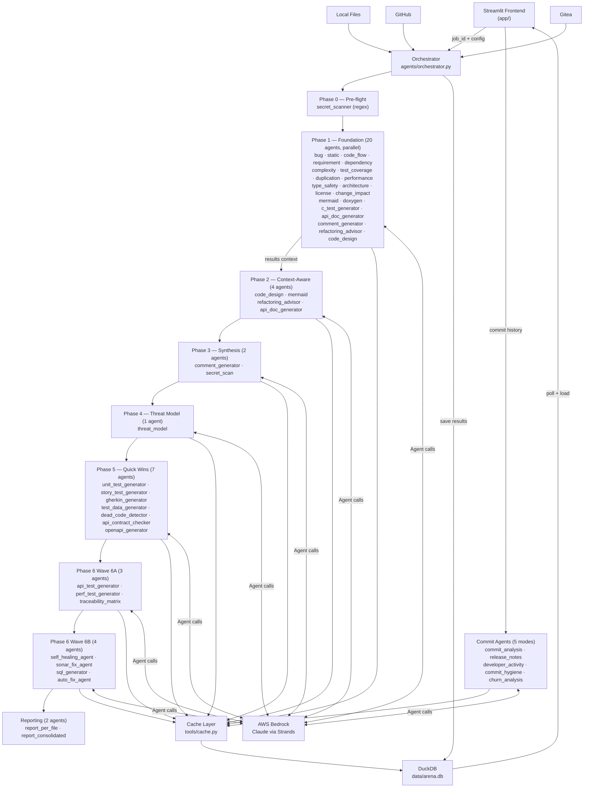
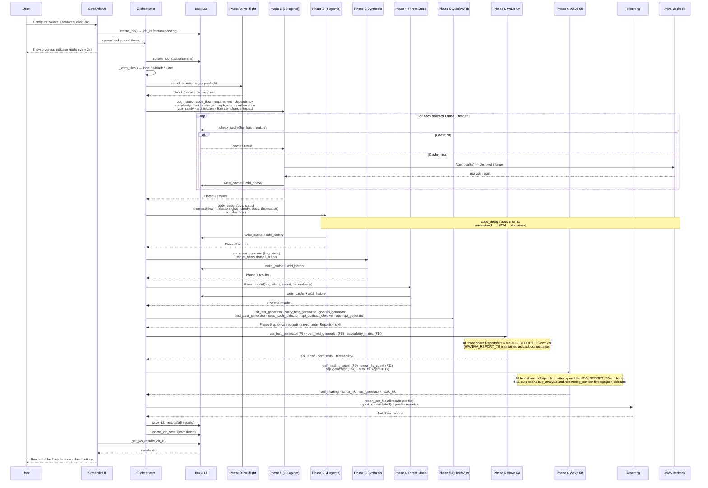
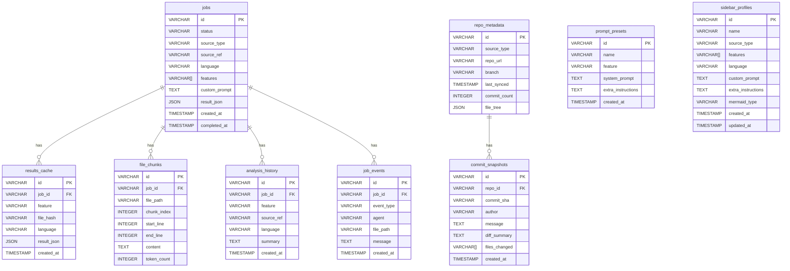

# AI Code Maniac — Multi-Agent Code Analysis Platform

**Using: AWS Bedrock (Claude) · Strands Agents · Streamlit · DuckDB**

AI Code Maniac orchestrates **41 specialized AI agents** across a coordinated **execution pipeline** (Phases 0–5 plus Phase 6 Waves 6A and 6B — spec-driven test generation, self-healing, SonarQube fixes, NL→SQL, and auto-fix patches) plus a standalone **5-mode commit analyser** to perform deep code analysis. Submit code from GitHub, Gitea, or local files and receive concurrent results across bug detection, complexity metrics, performance analysis, design review, refactoring advice, API documentation, security scanning, test generation, traceability, report generation, and more.

**Licensed under the GNU General Public License v3 (GPLv3).** See [LICENSE](LICENSE) for details.

---

## Table of Contents

- [Features](#features)
- [Architecture Overview](#architecture-overview)
- [Agent Execution Flow](#agent-execution-flow)
- [Prompt Template System](#prompt-template-system)
- [Report Generation](#report-generation)
- [Prerequisites](#prerequisites)
- [Quick Start](#quick-start)
- [Environment Variables](#environment-variables)
- [Agent Gating](#agent-gating)
- [Using the UI](#using-the-ui)
- [Running Tests](#running-tests)
- [Self-Hosted Gitea](#self-hosted-gitea)
- [Database Schema](#database-schema)
- [Project Structure](#project-structure)
- [Tech Stack](#tech-stack)
- [License](#license)

---

## Features

**41 specialized AI agents** organized into functional categories (including a **Phase 5 quick-wins pack**, a **Phase 6 Wave 6A spec-driven test generation pack**, and a **Phase 6 Wave 6B code-generation & fixes pack**), with a **2-agent reporting system** and **100+ prompt templates**:

### Code Quality & Metrics

| Agent Key | Agent | What It Produces |
|---|---|---|
| `bug_analysis` | Bug Analysis | Bugs with severity, root cause, runtime impact, and concrete fix suggestions |
| `static_analysis` | Static Analysis | Two-layer: flake8/ESLint linting + LLM semantic analysis (design smells, security anti-patterns, performance issues) |
| `code_complexity` | Code Complexity | Cyclomatic/cognitive complexity, maintainability index, per-function breakdown, hotspot identification |
| `duplication_detection` | Duplication Detection | Exact/near-duplicate code blocks, DRY violations, extraction suggestions with before/after code |
| `type_safety` | Type Safety | Type hint coverage, missing annotations, type issues, advanced typing suggestions |

### Code Understanding

| Agent Key | Agent | What It Produces |
|---|---|---|
| `code_flow` | Code Flow | Technical wiki-style execution-flow narrative for new team members |
| `requirement` | Requirement Analysis | Reverse-engineered functional & non-functional requirements in REQ-NNN format |
| `code_design` | Code Design | 3-turn principal-architect design review: understand > structured JSON > 9-section document |
| `architecture_mapper` | Architecture Mapper | Dependency map, import analysis, layer violations, coupling metrics, Mermaid component diagram |
| `mermaid` | Mermaid Diagrams | Flowchart, sequence, or class diagram as valid Mermaid syntax |
| `doxygen` | Doxygen Docs | Adds Doxygen comment headers to C/C++ functions, saves annotated source, generates HTML docs via Doxygen CLI |

### Performance & Optimization

| Agent Key | Agent | What It Produces |
|---|---|---|
| `performance_analysis` | Performance Analysis | Big-O analysis, memory patterns, N+1 queries, caching opportunities, scalability assessment |
| `refactoring_advisor` | Refactoring Advisor | Code smell inventory, Fowler-style refactoring suggestions with before/after code |

### Testing & Maintenance

| Agent Key | Agent | What It Produces |
|---|---|---|
| `test_coverage` | Test Coverage | Identifies untested functions, missing edge cases, suggests test cases and test skeletons |
| `c_test_generator` | C Test Generator | Generates Python pytest + ctypes test files for C code with type-safe bindings, saved to Reports/ |
| `change_impact` | Change Impact | Blast radius estimation, public API surface, change scenarios, side effect mapping |

### Security & Compliance

| Agent Key | Agent | What It Produces |
|---|---|---|
| `secret_scan` | Secret Scan | **Dual-phase:** Phase 0 regex pre-flight gate (block/redact/warn) + Phase 3 LLM deep scan for hardcoded secrets |
| `dependency_analysis` | Dependency Analysis | SCA: parses 20+ dependency file types across 7 ecosystems, CVE lookup via pluggable backends, risk assessment |
| `threat_model` | Threat Model | Two modes: **Formal (STRIDE)** framework analysis or **Attacker Narrative** penetration test |
| `license_compliance` | License Compliance | License detection, compatibility matrix, copyleft obligations, attribution requirements |

### Documentation & Review

| Agent Key | Agent | What It Produces |
|---|---|---|
| `api_doc_generator` | API Doc Generator | Full API documentation: classes, functions, usage examples, error handling |
| `comment_generator` | PR Comments | GitHub-style review comments generated from bug + static findings |

### Phase 5 — Quick Wins (Test Gen, Spec & Hygiene)

| Agent Key | Feature | Agent | What It Produces |
|---|---|---|---|
| `unit_test_generator` | F1 | Multi-language Unit Test Generator | Framework-appropriate unit tests (pytest, JUnit, xUnit, Jest, …) with mocks, parameterized and edge cases |
| `story_test_generator` | F2 | Story-to-Test-Case Generator | Positive / negative / functional / NFR test cases from user stories |
| `gherkin_generator` | F3 | BDD / Gherkin Feature File Generator | Given-When-Then `.feature` files for Cucumber / Robot Framework |
| `test_data_generator` | F8 | Test Data Generator | Synthetic, rule-based, boundary, negative, PII-safe datasets |
| `dead_code_detector` | F17 | Dead-Code / Unused-Symbol Detector | Unreachable functions, unused imports, dead branches across multi-language repos |
| `api_contract_checker` | F24 | API-Contract Conformance Checker | Diff between declared OpenAPI/Swagger spec and actual code surface |
| `openapi_generator` | F37 | OpenAPI / Swagger Generator | Bidirectional OpenAPI 3.x spec from code **or** from requirements text |

**Phase 5 CLI / Server Tools (not agents):**

| Feature | Tool | Purpose |
|---|---|---|
| F20 | `tools/webhook_server.py` | CI/CD-triggered code review webhook (Jenkins / GitHub Actions / Bitbucket / GitLab / Azure DevOps) |
| F21 | `tools/precommit_reviewer.py` | Pre-commit / staged-change reviewer — Git hook that reviews only the diff |

### Phase 6 Wave 6A — Spec-Driven Test Generation & Traceability

| Agent Key | Feature | Agent | What It Produces |
|---|---|---|---|
| `api_test_generator` | F5 | API Test Generator (OpenAPI → tests) | Language-appropriate API test file (REST Assured / pytest+requests / xUnit / Jest) plus a ready-to-import `api_collection.json` (Postman v2.1) |
| `perf_test_generator` | F6 | Perf / Load Test Generator | JMeter `plan.jmx` **or** Gatling `Simulation.scala`, driven by OpenAPI spec or a requirements story (think time, ramp, SLA) |
| `traceability_matrix` | F10 | Traceability Matrix + Coverage Gap Finder | `matrix.csv` + `matrix.md` mapping stories ↔ tests, plus `gaps.md` listing untested stories; optionally invokes `test_coverage` subagent when source folder is supplied |

Wave 6A agents share a single per-run report folder (`Reports/<YYYYMMDD_HHMMSS>/`) via the `JOB_REPORT_TS` env var set by the orchestrator, so F5 / F6 / F10 outputs land alongside each other. (The legacy `WAVE6A_REPORT_TS` name is maintained as a back-compat alias for one release.)

### Phase 6 Wave 6B — Code Generation & Fixes

| Agent Key | Feature | Agent | Input | Output Folder |
|---|---|---|---|---|
| `self_healing_agent` | F9 | Self-Healing Test Agent | `__page_html__` DOM snapshot + broken selector list | `self_healing/` — patched test files + `patches/<file>.diff` + `pr_comment.md` + `summary.json` |
| `sonar_fix_agent` | F11 | SonarQube Fix Automation | Sonar REST issues (`__sonar_issues__`) or project key + `__sonar_top_n__=<int>` (default 50) | `sonar_fix/` — patched source files + `patches/<file>.diff` + `pr_comment.md` + `summary.json` |
| `sql_generator` | F14 | NL → SQL / Stored-Procedure Generator | `__prompt__` (NL request) + `__db_schema__` (DDL or YAML, schema-aware, RLS-aware) | `sql_generator/` — `.sql` files + `patches/*.diff` + `pr_comment.md` + `summary.json` |
| `auto_fix_agent` | F15 | Auto-Fix / Patch Generator | Auto-scan of Bug Analysis + Refactoring Advisor `findings.json` sidecars, or inline `__findings__` | `auto_fix/` — patched source + `patches/<file>.diff` + `pr_comment.md` + `summary.json` |

All four Wave 6B agents share `tools/patch_emitter.py` for deterministic unified-diff output (CRLF-normalized, empty-base `@@ -0,0 +N,M @@` origin, tolerant of `\ No newline at end of file` markers). They share the same `Reports/<ts>/` via `JOB_REPORT_TS` so a single run can produce a coordinated PR across multiple fix types.

**Reserved but not yet implemented:** `__page_url__=<url>` is a reserved F9 prefix for future headless-browser DOM fetch. **F13 (Code-from-Prompt Generator, 6 frameworks) is deferred** to its own future wave.

### Commit Analysis (5 modes)

| Agent Key | Mode | What It Produces |
|---|---|---|
| `commit_analysis` | Commit Analysis | Release readiness, risk-level score, and changelog from git commit history |
| `release_notes` | Release Notes | Polished user-facing release notes grouped by features, fixes, improvements, breaking changes |
| `developer_activity` | Developer Activity | Contributor stats, activity timeline, collaboration patterns, bus-factor risks |
| `commit_hygiene` | Commit Hygiene | Conventional Commits compliance audit, message quality, squash candidates |
| `churn_analysis` | Churn Analysis | File hotspot detection, co-change patterns, stability report (clone source only) |

### Reporting System

| Agent Key | Agent | What It Produces |
|---|---|---|
| `report_per_file` | Per-File Report | Assembles all analysis results for a single file into a structured Markdown document (no LLM calls) |
| `report_consolidated` | Consolidated Report | Synthesizes per-file reports into one cohesive document — **three modes:** `template` (fastest, no LLM), `llm` (full narrative), `hybrid` (template skeleton + LLM executive summary and conclusion) |

### Platform-Level Capabilities

- Multi-file and recursive-folder analysis (up to 50 files per job)
- Line-range targeting within a single file
- Repository cloning — clone GitHub repos by URL or `owner/repo` shorthand for commit and churn analysis
- Composite result caching — same file + feature + language + prompt always hits cache, skipping Bedrock
- Named sidebar settings profiles — save/load/delete full analysis configurations across sessions
- Custom prompt overrides and per-feature prompt presets
- **100+ built-in prompt templates** across 13+ categories (Deep Analysis, Security Focused, Compliance, Performance, Language Expert, and more)
- Template browser page — filter and explore all available templates by category and agent
- JSON + Markdown export for every result tab
- Per-file and consolidated report generation (Markdown + HTML via built-in converter)
- Web scraper tool — extract clean text from any URL for analysis
- Markdown-to-HTML converter with Pygments syntax highlighting, sidebar TOC, and collapsible sections
- DuckDB-backed local storage for jobs, cache, history, presets, profiles, and real-time job events
- Dual-phase security architecture — Phase 0 regex pre-flight gate + Phase 3 LLM deep scan
- Dashboard home page with pipeline visualization, agent metrics, and feature category cards

---

## Architecture Overview



---

## Agent Execution Flow



---

## Prompt Template System

The platform includes **100+ built-in prompt templates** organized into a pluggable category system. Templates augment (not replace) each agent's base system prompt with specialized analysis guidance.

### Template Categories

| Category | Source | Description |
|---|---|---|
| Deep Analysis | `prompt_templates.py` | Exhaustive analysis frameworks for each agent |
| Security Focused | `prompt_templates.py` | OWASP/CWE-oriented analysis guidance |
| Architecture Reverse Engineering | `prompt_templates.py` | Pattern and structure discovery |
| + 10 more built-in | `prompt_templates.py` | Various specialized analysis angles |
| Compliance: SOC 2 / GDPR / PCI-DSS / HIPAA / ISO 27001 | `templates/compliance.py` | Per-standard compliance audit guidance (6 standards) |
| Language Expert (9 families) | `templates/language_expert.py` | Language-family-specific analysis (Python, C/C++, JVM, Functional, etc.) |
| Performance Deep Dive | `templates/performance.py` | Algorithmic complexity, memory, I/O, concurrency analysis |

### Language Families

Language Expert templates map detected languages into paradigm families via `config/language_families.py`:

| Family | Languages |
|---|---|
| `dynamic_scripting` | Python, Ruby, PHP, Perl, Lua, R |
| `systems` | C, C++, Rust, Objective-C |
| `jvm` | Java, Kotlin, Scala, Groovy, Clojure |
| `functional` | Haskell, Lisp, F#, Erlang, Elixir |
| `web_frontend` | JavaScript, TypeScript |
| `dotnet` | C#, VB.NET, F# |
| `mobile` | Swift, Kotlin, Dart |
| `data_infra` | SQL, HCL, YAML |
| `shell` | Bash, PowerShell, Zsh |

### How Templates Work

1. User selects a template category on the **Code Analysis** or **Templates** page.
2. The system looks up the template matching the selected category + agent.
3. The template text is appended to the agent's default system prompt as additional guidance.
4. Agent runs with enhanced instructions — no base behaviour is lost.

---

## Report Generation

After all analysis phases complete, the platform can generate structured reports in two stages:

### Per-File Reports (`report_per_file`)

Assembles all analysis results for a single file into a single Markdown document. **No LLM calls** — pure template assembly. Sections appear in canonical order: Requirements > Code Flow > Code Design > Bug Analysis > Static Analysis > Mermaid Diagram > PR Comments.

### Consolidated Reports (`report_consolidated`)

Synthesizes all per-file reports into one cohesive document. Three generation modes:

| Mode | LLM Calls | Speed | Output Quality |
|---|---|---|---|
| `template` | 0 | Fastest | Structured but mechanical |
| `hybrid` | 1 | Balanced | Template skeleton + LLM executive summary and conclusion |
| `llm` | 1 | Slowest | Full narrative document |

Reports are available as **Markdown** and **HTML** (via the built-in converter with Pygments syntax highlighting, sidebar TOC, and collapsible sections).

### Reports Folder Layout (per run)

Every orchestrated run creates a timestamped subfolder under `Reports/`. Phase 5 quick-win agents, the three Wave 6A agents, and the four Wave 6B agents deposit their outputs into dedicated subfolders so a single run can hold tests, perf scripts, traceability matrix, fix patches, and consolidated reports side by side:

```
Reports/<JOB_REPORT_TS>/
├── api_tests/              # F5 — <language> API test file + api_collection.json (Postman v2.1)
├── perf_tests/             # F6 — plan.jmx  OR  Simulation.scala
├── traceability/           # F10 — matrix.csv + matrix.md + gaps.md
├── self_healing/           # F9 — patched test files + patches/<file>.diff + pr_comment.md + summary.json
├── sonar_fix/              # F11 — patched source + patches/<file>.diff + pr_comment.md + summary.json
├── sql_generator/          # F14 — .sql files + patches/*.diff + pr_comment.md + summary.json
├── auto_fix/               # F15 — patched source + patches/<file>.diff + pr_comment.md + summary.json
├── bug_analysis/           # findings.json sidecar (F15 auto-scan source)
├── refactoring_advisor/    # findings.json sidecar (F15 auto-scan source)
├── unit_tests/             # F1 — framework-appropriate unit test files
├── gherkin/                # F3 — .feature files
├── test_data/              # F8 — synthetic data sets
├── openapi/                # F37 — openapi.yaml / openapi.json
└── … (per-agent folders from Phase 1–4 + report_per_file / report_consolidated output)
```

All multi-agent outputs in a single run share the same `Reports/<ts>/` because the orchestrator sets `JOB_REPORT_TS` once at the start of `run_analysis` before dispatching any sub-agent. The legacy `WAVE6A_REPORT_TS` name is honoured as a back-compat alias for one release.

### Intake Conventions (custom_prompt prefix markers)

Phase 5, Wave 6A and Wave 6B agents read structured inputs piggy-backed onto the `custom_prompt` field. The orchestrator / UI helper prepends these prefix markers so a single run can feed several agents with coordinated data:

| Prefix marker | Used by | Purpose |
|---|---|---|
| `__openapi_spec__\n<YAML>` | F5, F6 | OpenAPI spec mode — spec body follows the marker |
| `__mode__requirements\n<story>` | F6 | Requirements mode — generate perf script from a story instead of a spec |
| `__stories__\n<text>` | F10 | Stories input block for the traceability matrix |
| `__tests_dir__=<path>` | F10 | Absolute path to the tests folder to scan |
| `__src_dir__=<path>` | F10 | Optional code folder; if present, F10 invokes the `test_coverage` subagent |
| `__page_html__\n<html>` | F9 | Current DOM snapshot for selector self-healing |
| `__page_url__=<url>` | F9 | **Reserved** — future headless-browser fetch (not yet implemented) |
| `__sonar_issues__\n<json>` | F11 | Inline override of Sonar REST API / file fetch |
| `__sonar_top_n__=<int>` | F11 | Issue cap (default `50`) |
| `__prompt__\n<description>` | F14 | Required natural-language request |
| `__db_schema__\n<DDL or YAML>` | F14 | Inline schema override (tables, columns, views, RLS policies) |
| `__findings__\n<json or markdown>` | F15 | Alternative to auto-scan of bug_analysis/ + refactoring_advisor/ findings.json sidecars |
| `__append__\n` | helpers | Generic marker from `agents/_bedrock._APPEND_PREFIX`, used by sibling-agent UI helpers to preserve sibling-agent prompts |

---

## Prerequisites

| Requirement | Version |
|---|---|
| Python | 3.11+ |
| AWS account with Bedrock access | — |
| Claude model enabled in Bedrock | `anthropic.claude-3-5-sonnet-20241022-v2:0` (default) |
| Docker (optional, for Gitea) | 20+ |

---

## Quick Start

### Windows (one-click)

```bat
startup.bat
```

The script activates the virtual environment, installs dependencies, kills stale Streamlit processes, and opens the app at `http://localhost:8501`.

### Linux / macOS

```bash
python -m venv venv && source venv/bin/activate
pip install -r requirements.txt
cp .env.example .env   # fill in credentials
streamlit run app/Home.py
```

---

## Environment Variables

Copy `.env.example` to `.env`.

### Required — AWS Bedrock

| Variable | Default | Description |
|---|---|---|
| `AWS_REGION` | `us-east-1` | AWS region where Bedrock is enabled |
| `AWS_ACCESS_KEY_ID` | — | IAM access key ID |
| `AWS_SECRET_ACCESS_KEY` | — | IAM secret access key |
| `AWS_SESSION_TOKEN` | — | Optional; required for temporary / assumed-role credentials |
| `BEDROCK_MODEL_ID` | `anthropic.claude-3-5-sonnet-20241022-v2:0` | Claude model ID |
| `BEDROCK_TEMPERATURE` | `0.3` | Sampling temperature (0.0 – 1.0) |

### Optional — Integrations

| Variable | Default | Description |
|---|---|---|
| `GITHUB_TOKEN` | — | Personal access token for private GitHub repos |
| `GITEA_URL` | `http://localhost:3000` | Base URL of your Gitea instance |
| `GITEA_TOKEN` | — | Gitea API token |

### Optional — App Settings

| Variable | Default | Description |
|---|---|---|
| `DB_PATH` | `data/arena.db` | DuckDB file path |
| `MAX_FILES` | `50` | Max files per job (1 – 100) |
| `ENABLED_AGENTS` | `all` | Comma-separated agent keys; see [Agent Gating](#agent-gating) |
| `SECRET_SCAN_MODE` | `warn` | Phase 0 pre-flight action: `block`, `redact`, or `warn` |

---

## Agent Gating

`ENABLED_AGENTS` controls which agents are available without touching code. Disabled agents are hidden from the UI and never invoked by the orchestrator.

```bash
# Full suite (default)
ENABLED_AGENTS=all

# Bug-finder profile
ENABLED_AGENTS=bug_analysis,static_analysis,comment_generator

# Design-review profile
ENABLED_AGENTS=code_design,requirement,code_flow,mermaid,architecture_mapper

# Quality & metrics profile
ENABLED_AGENTS=code_complexity,duplication_detection,performance_analysis,type_safety,refactoring_advisor

# Security-only profile
ENABLED_AGENTS=secret_scan,dependency_analysis,threat_model,license_compliance

# Commit-reviewer only
ENABLED_AGENTS=commit_analysis,release_notes,developer_activity,commit_hygiene,churn_analysis
```

Unknown keys are silently dropped.

---

## Using the UI

### Pages

| Page | Purpose |
|---|---|
| **Home** | Dashboard with pipeline visualization strip (8 phases, incl. Phase 6 Wave 6A and Wave 6B), agent metrics, and feature category cards |
| **Code Analysis** | Run code analysis jobs with source, feature, and security selectors |
| **Commit Analysis** | 5 commit analysis modes: Commit Analysis, Release Notes, Developer Activity, Commit Hygiene, Churn Analysis |
| **History** | Browse past analyses with filter by feature and language |
| **Presets** | Manage custom prompt presets per agent |
| **Settings** | AWS/Bedrock config, integration tokens, security settings, temperature override, DB export/import |
| **Templates** | Browse and filter 100+ built-in prompt templates by category and agent |

### Home Dashboard

The Home page provides a high-level overview of the platform:

- **Pipeline strip** — visual representation of the execution pipeline (Phases 0–5 foundation + Phase 5 quick wins + Phase 6 Wave 6A spec-driven tests + Phase 6 Wave 6B code-generation & fixes) plus standalone commit modes, showing agent count per phase
- **Metrics row** — total analyses run, completed count, distinct languages analysed, total agent count
- **Feature cards** — 7 expandable category cards showing all agents grouped by function

### Run a Code Analysis

1. Go to **Code Analysis**.
2. In the sidebar, select a **source**:
   - **Local File** — upload files, enter a path, or scan a folder recursively.
   - **GitHub** — `owner/repo`, branch, file path.
   - **Gitea** — Gitea URL, `owner/repo`, branch, file path.
3. Optionally set a **line range** (start / end line).
4. Select one or more **agents** from the feature checkboxes.
5. Optionally enable **security testing** (Secret Scan, Dependency Analysis, Threat Model) with a choice of STRIDE or Attacker Narrative mode for threat modelling.
6. Optionally set a **language** (auto-detected if blank), **Mermaid type**, and **prompt template**.
7. Click **Run Analysis**. Results appear in tabs once the job completes.
8. Security results render in a separate section below the main analysis tabs, with a Phase 0 pre-flight banner showing gate status.
9. Download any result as **JSON** or **Markdown** from the result tabs.

### Run a Commit Analysis

1. Go to **Commit Analysis**.
2. Select a **source** — local clone path or GitHub `owner/repo`.
3. Choose one or more commit analysis **modes**.
4. Click **Run**. Results appear in tabs.

### Settings Profiles

Save the full sidebar configuration (source type, features, language, custom prompt, Mermaid type) as a named profile. Profiles persist across sessions in DuckDB.

### Prompt Presets

Override an agent's system prompt or append extra instructions for a single run from the **Advanced** expander. Save frequently used overrides as named presets.

### Template Browser

Browse all 100+ built-in prompt templates on the **Templates** page. Filter by category (Deep Analysis, Compliance: GDPR, Language Expert: Python, etc.) and by agent to find the right template for your analysis.

---

## Running Tests

```bash
# Full suite
pytest

# Single file
pytest tests/agents/test_code_design.py -v

# Single test
pytest tests/db/test_queries.py::test_cache_store_and_hit -v
```

---

## Self-Hosted Gitea

```bash
cd docker && docker compose up -d
```

- Web UI: `http://localhost:3000`
- Complete the setup wizard on first visit.
- Create an account > **Settings > Applications > Generate API token**.
- Add to `.env`: `GITEA_TOKEN=<token>` and `GITEA_URL=http://localhost:3000`.

---

## Database Schema



---

## Project Structure

```
ai_code_maniac/
├── app/
│   ├── Home.py                    # Dashboard with pipeline strip, metrics, and feature cards
│   ├── components/
│   │   ├── feature_selector.py    # Agent checkboxes, language, template selector
│   │   ├── mermaid_renderer.py    # Mermaid.js HTML component
│   │   ├── result_tabs.py         # Per-feature tabbed result renderers
│   │   ├── security_results.py    # Security findings renderer + Phase 0 banner
│   │   ├── security_selector.py   # Security testing feature selector (sidebar)
│   │   ├── sidebar_profile.py     # Settings profile load/save/delete
│   │   └── source_selector.py     # Local / GitHub / Gitea input widget
│   └── pages/
│       ├── 1_Code_Analysis.py     # Main code analysis interface (background thread)
│       ├── 2_Commit_Analysis.py   # Commit history analysis (5 modes)
│       ├── 3_History.py           # Browse + filter past analyses
│       ├── 4_Presets.py           # Prompt preset CRUD
│       ├── 5_Settings.py          # Config, security settings, temperature, DB backup
│       └── 6_Templates.py         # Browse + filter 100+ prompt templates
├── agents/
│   ├── _bedrock.py                # Bedrock model factory (boto3 session)
│   ├── orchestrator.py            # Phase 0 → 5 + Wave 6A + Wave 6B pipeline coordinator
│   ├── api_contract_checker.py    # F24 — declared OpenAPI ↔ code conformance
│   ├── api_doc_generator.py       # API documentation generation
│   ├── api_test_generator.py      # F5 — API tests + Postman collection from OpenAPI (Wave 6A)
│   ├── architecture_mapper.py     # Module dependencies + layer violations
│   ├── auto_fix_agent.py          # F15 — Auto-Fix / Patch Generator (Wave 6B)
│   ├── bug_analysis.py            # Bug detection with severity + root cause (+ findings.json sidecar)
│   ├── c_test_generator.py        # Python pytest + ctypes tests for C code
│   ├── change_impact.py           # Blast radius + API surface analysis
│   ├── churn_analysis.py          # File hotspot + co-change detection
│   ├── code_complexity.py         # Cyclomatic/cognitive complexity metrics
│   ├── code_design.py             # 3-turn design document generation
│   ├── code_flow.py               # Execution flow narrative
│   ├── comment_generator.py       # GitHub-style PR review comments
│   ├── commit_analysis.py         # Commit history + risk assessment
│   ├── commit_hygiene.py          # Conventional Commits compliance audit
│   ├── comparison.py              # Compare 2–5 analysis results
│   ├── dead_code_detector.py      # F17 — unused symbols / unreachable code
│   ├── dependency_analysis.py     # SCA: dependency parsing + CVE lookup
│   ├── developer_activity.py      # Contributor stats + activity patterns
│   ├── doxygen_agent.py           # Doxygen comment headers + HTML generation
│   ├── duplication_detection.py   # Code clone + DRY violation detection
│   ├── gherkin_generator.py       # F3 — BDD / Gherkin feature file generator
│   ├── license_compliance.py      # License detection + compatibility checks
│   ├── mermaid.py                 # Mermaid diagram generation
│   ├── openapi_generator.py       # F37 — OpenAPI spec from code OR requirements
│   ├── performance_analysis.py    # Big-O, memory, I/O, scalability analysis
│   ├── perf_test_generator.py     # F6 — JMeter / Gatling perf scripts (Wave 6A)
│   ├── refactoring_advisor.py     # Code smells + refactoring suggestions (+ findings.json sidecar)
│   ├── release_notes.py           # User-facing release notes from commits
│   ├── report_consolidated.py     # Consolidated report (template/LLM/hybrid)
│   ├── report_per_file.py         # Per-file markdown report assembly
│   ├── requirement.py             # Requirement reverse-engineering
│   ├── secret_scan.py             # Phase 0 regex + Phase 3 LLM secret detection
│   ├── self_healing_agent.py      # F9 — Self-Healing Test Agent (UI selector drift, Wave 6B)
│   ├── sonar_fix_agent.py         # F11 — SonarQube issue fixes (Wave 6B)
│   ├── sql_generator.py           # F14 — NL→SQL with schema awareness (Wave 6B)
│   ├── static_analysis.py         # Linting + semantic analysis
│   ├── story_test_generator.py    # F2 — test cases from user stories
│   ├── test_coverage.py           # Test gap analysis + test case suggestions
│   ├── test_data_generator.py     # F8 — synthetic / rule-based / PII-safe datasets
│   ├── threat_model.py            # STRIDE / attacker-narrative threat model
│   ├── traceability_matrix.py     # F10 — stories ↔ tests matrix + gap report (Wave 6A)
│   ├── type_safety.py             # Type hint coverage + type issue detection
│   └── unit_test_generator.py     # F1 — multi-language unit tests (pytest/JUnit/Jest/…)
├── tools/
│   ├── cache.py                   # SHA256-keyed composite cache helpers
│   ├── chunk_file.py              # Token-aware file splitter with overlap
│   ├── clone_repo.py              # GitHub URL parser + git clone/pull + log
│   ├── ddl_parser.py              # Wave 6B — F14 regex DDL parser (tables, columns, views, RLS policies)
│   ├── dependency_parser.py       # Multi-ecosystem dependency file parser (20+ types)
│   ├── fetch_github.py            # PyGithub file + PR diff fetcher
│   ├── fetch_gitea.py             # httpx Gitea REST client
│   ├── fetch_local.py             # Local file I/O + recursive folder scan
│   ├── language_detect.py         # File extension → language name (40+ langs)
│   ├── load_profile_builder.py    # Wave 6A — ramp/think-time/SLA load profile derivation
│   ├── md_to_html.py              # Lightweight Markdown → HTML (stdlib only)
│   ├── openapi_parser.py          # Phase 5 — OpenAPI 3.x / Swagger parser (endpoints, schemas)
│   ├── patch_emitter.py           # Wave 6B — shared deterministic PR-patch emitter (all 4 Wave 6B agents)
│   ├── postman_emitter.py         # Wave 6A — Postman v2.1 collection emitter
│   ├── precommit_reviewer.py      # F21 — pre-commit / staged-diff reviewer (git hook)
│   ├── python_html_converter.py   # Markdown → HTML with Pygments, TOC, collapsible sections
│   ├── run_doxygen.py             # Doxygen CLI wrapper + Doxyfile generator
│   ├── run_linter.py              # flake8 / ESLint subprocess runner
│   ├── secret_scanner.py          # Phase 0 regex pre-flight scanner (no LLM)
│   ├── sonar_fetcher.py           # Wave 6B — F11 Sonar REST API fetcher (stdlib urllib only)
│   ├── spec_fetcher.py            # Phase 5 — fetch OpenAPI specs from URL or path
│   ├── test_scanner.py            # Wave 6A — discover tests + story IDs for F10 matrix
│   ├── web_scraper.py             # URL text scraper (httpx, CLI + importable)
│   ├── webhook_server.py          # F20 — CI/CD-triggered review webhook (Jenkins/GH Actions/…)
│   └── cve_backends/              # Pluggable CVE lookup backends
│       ├── __init__.py            # Backend registry + get_backend() dispatcher
│       ├── osv.py                 # OSV.dev API backend
│       ├── nvd.py                 # NIST NVD API backend
│       ├── github_advisory.py     # GitHub Advisory Database backend
│       ├── llm_only.py            # LLM-based vulnerability assessment
│       └── hybrid.py              # OSV + NVD + LLM combined backend
├── config/
│   ├── settings.py                # Pydantic BaseSettings (.env-backed)
│   ├── language_families.py       # Language → paradigm family mapping (9 families)
│   ├── prompt_templates.py        # 100+ built-in prompt templates (13+ categories)
│   └── templates/                 # Category-specific template modules
│       ├── compliance.py          # SOC 2, GDPR, PCI-DSS, HIPAA, ISO 27001 templates
│       ├── language_expert.py     # 72 language-family-specific templates (9 families × 8 agents)
│       └── performance.py         # Performance Deep Dive templates
├── db/
│   ├── connection.py              # Thread-safe DuckDB singleton connection
│   ├── schema.py                  # 9-table DDL + auto-migration
│   └── queries/
│       ├── cache.py               # Cache read/write
│       ├── chunks.py              # File chunk store/retrieve
│       ├── history.py             # Analysis audit trail
│       ├── jobs.py                # Job CRUD
│       ├── job_events.py          # Real-time job progress events
│       ├── presets.py             # Prompt preset CRUD
│       ├── repo_metadata.py       # Repo + commit snapshot storage
│       └── sidebar_profiles.py    # Settings profile CRUD
├── tests/                         # pytest suite
│   ├── agents/
│   ├── db/
│   ├── tools/
│   └── integration/
├── docker/
│   └── docker-compose.yml         # Gitea self-hosted git service
├── data/                          # DuckDB file (auto-created on first run)
├── LICENSE                        # GNU General Public License v3
├── .env.example
├── requirements.txt
├── md2html.bat                    # Windows batch wrapper for md_to_html.py
└── startup.bat                    # Windows one-click launcher
```

---

## Tech Stack

| Layer | Technology |
|---|---|
| Frontend | Streamlit 1.56+ |
| AI Backend | AWS Bedrock — Claude (via Strands Agents 1.34+) |
| Database | DuckDB 1.5+ |
| GitHub integration | PyGithub 2.9+ |
| Gitea integration | httpx 0.28+ |
| Python linting | flake8 7+ |
| JS/TS linting | ESLint (subprocess) |
| Configuration | Pydantic Settings 2.x |
| Testing | pytest 9.x + pytest-mock 3.15+ |
| HTML report rendering | Pygments (syntax highlighting) |

---

## License

This project is licensed under the **GNU General Public License v3 (GPLv3)**.

You are free to redistribute and modify this software under the terms of the GPL v3. See the [LICENSE](LICENSE) file for the full license text.

Copyright (C) 2026 B.Vignesh Kumar (Bravetux) <ic19939@gmail.com>

---

*Developed by B.Vignesh Kumar — ic19939@gmail.com*
