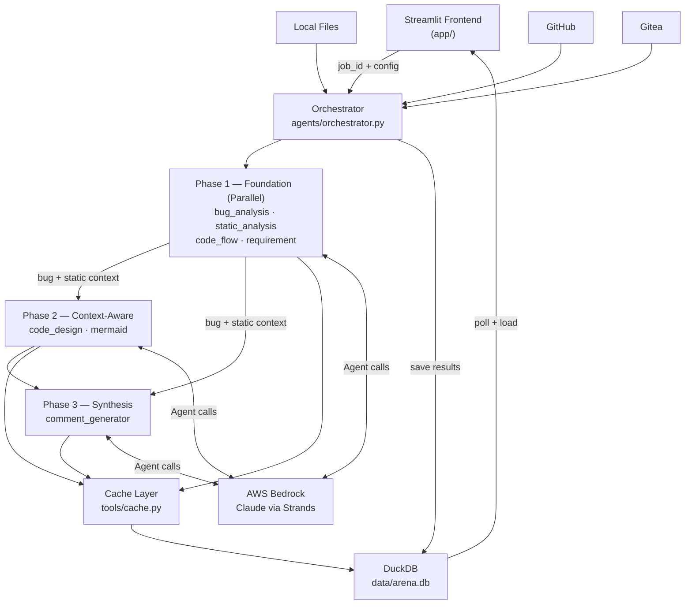
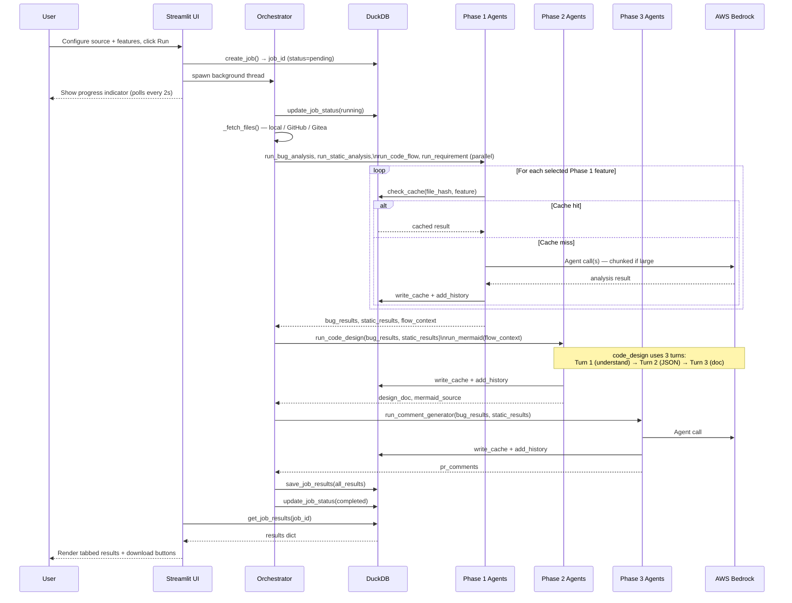
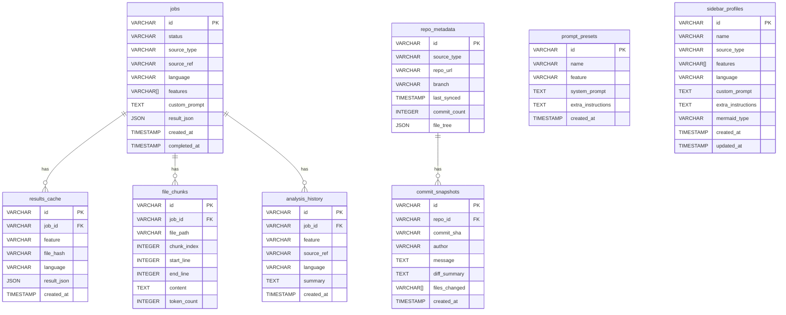

# AI Code Maniac — Multi-Agent Code Analysis Platform

**Using: AWS Bedrock (Claude) · Strands Agents · Streamlit · DuckDB**

AI Code Maniac orchestrates up to **8 specialized AI agents** in a coordinated 3-phase pipeline to perform deep code analysis. Submit code from GitHub, Gitea, or local files and receive concurrent results: bug detection, design review, execution-flow documentation, requirement extraction, static analysis, Mermaid diagrams, PR comments, and commit-history assessment.

---

## Table of Contents

- [Features](#features)
- [Architecture Overview](#architecture-overview)
- [Agent Execution Flow](#agent-execution-flow)
- [Prerequisites](#prerequisites)
- [Quick Start](#quick-start)
- [Environment Variables](#environment-variables)
- [Agent Gating](#agent-gating)
- [Using the UI](#using-the-ui)
- [Running Tests](#running-tests)
- [Self-Hosted Gitea](#self-hosted-gitea)
- [Database Schema](#database-schema)
- [Project Structure](#project-structure)
- [Tech Stack](#tech-stack)

---

## Features

| Agent Key | Agent | What It Produces |
|---|---|---|
| `bug_analysis` | Bug Analysis | Bugs with severity, root cause, runtime impact, and concrete fix suggestions |
| `static_analysis` | Static Analysis | Two-layer: flake8/ESLint linting + LLM semantic analysis (design smells, security anti-patterns, performance issues) |
| `code_flow` | Code Flow | Technical wiki-style execution-flow narrative for new team members |
| `requirement` | Requirement Analysis | Reverse-engineered functional & non-functional requirements in REQ-NNN format |
| `code_design` | Code Design | 3-turn principal-architect design review: understand → structured JSON → 9-section markdown document |
| `mermaid` | Mermaid Diagrams | Flowchart, sequence, or class diagram as valid Mermaid syntax |
| `comment_generator` | PR Comments | GitHub-style review comments generated from bug + static findings |
| `commit_analysis` | Commit Analysis | Release readiness, risk-level score, and changelog from git commit history |

**Platform-level capabilities:**

- Multi-file and recursive-folder analysis (up to 50 files per job)
- Line-range targeting within a single file
- Composite result caching — same file + feature + language + prompt always hits cache, skipping Bedrock
- Named sidebar settings profiles — save/load/delete full analysis configurations across sessions
- Custom prompt overrides and per-feature prompt presets
- JSON + Markdown export for every result tab
- DuckDB-backed local storage for jobs, cache, history, presets, and profiles

---

## Architecture Overview



---

## Agent Execution Flow



---

## Prerequisites

| Requirement | Version |
|---|---|
| Python | 3.11+ |
| AWS account with Bedrock access | — |
| Claude model enabled in Bedrock | `anthropic.claude-3-5-sonnet-20241022-v2:0` (default) |
| Docker (optional, for Gitea) | 20+ |

---

## Quick Start

### Windows (one-click)

```bat
startup.bat
```

The script activates the virtual environment, installs dependencies, kills stale Streamlit processes, and opens the app at `http://localhost:8501`.

### Linux / macOS

```bash
python -m venv venv && source venv/bin/activate
pip install -r requirements.txt
cp .env.example .env   # fill in credentials
streamlit run app/Home.py
```

---

## Environment Variables

Copy `.env.example` to `.env`.

### Required — AWS Bedrock

| Variable | Default | Description |
|---|---|---|
| `AWS_REGION` | `us-east-1` | AWS region where Bedrock is enabled |
| `AWS_ACCESS_KEY_ID` | — | IAM access key ID |
| `AWS_SECRET_ACCESS_KEY` | — | IAM secret access key |
| `AWS_SESSION_TOKEN` | — | Optional; required for temporary / assumed-role credentials |
| `BEDROCK_MODEL_ID` | `anthropic.claude-3-5-sonnet-20241022-v2:0` | Claude model ID |
| `BEDROCK_TEMPERATURE` | `0.3` | Sampling temperature (0.0 – 1.0) |

### Optional — Integrations

| Variable | Default | Description |
|---|---|---|
| `GITHUB_TOKEN` | — | Personal access token for private GitHub repos |
| `GITEA_URL` | `http://localhost:3000` | Base URL of your Gitea instance |
| `GITEA_TOKEN` | — | Gitea API token |

### Optional — App Settings

| Variable | Default | Description |
|---|---|---|
| `DB_PATH` | `data/arena.db` | DuckDB file path |
| `MAX_FILES` | `50` | Max files per job (1 – 100) |
| `ENABLED_AGENTS` | `all` | Comma-separated agent keys; see [Agent Gating](#agent-gating) |

---

## Agent Gating

`ENABLED_AGENTS` controls which agents are available without touching code. Disabled agents are hidden from the UI and never invoked by the orchestrator.

```bash
# Full suite (default)
ENABLED_AGENTS=all

# Bug-finder profile
ENABLED_AGENTS=bug_analysis,static_analysis,comment_generator

# Design-review profile
ENABLED_AGENTS=code_design,requirement,code_flow,mermaid

# Commit-reviewer only
ENABLED_AGENTS=commit_analysis
```

Unknown keys are silently dropped.

---

## Using the UI

### Pages

| Page | Purpose |
|---|---|
| **Home** | Dashboard — recent jobs and quick stats |
| **Analysis** | Run a new analysis job |
| **History** | Browse past analyses with filter by feature and language |
| **Commits** | Run commit-history analysis from GitHub or Gitea |
| **Presets** | Manage custom prompt presets |
| **Settings** | View config, adjust temperature, export/import database |

### Run a New Analysis

1. Go to **Analysis**.
2. In the sidebar, select a **source**:
   - **Local File** — upload files, enter a path, or scan a folder recursively.
   - **GitHub** — `owner/repo`, branch, file path.
   - **Gitea** — Gitea URL, `owner/repo`, branch, file path.
3. Optionally set a **line range** (start / end line).
4. Select one or more **agents** from the feature checkboxes.
5. Optionally set a **language** (auto-detected if blank) and **Mermaid type**.
6. Click **Run Analysis**. Results appear in tabs once the job completes.
7. Download any result as **JSON** or **Markdown** from the result tabs.

### Settings Profiles

Save the full sidebar configuration (source type, features, language, custom prompt, Mermaid type) as a named profile. Profiles persist across sessions in DuckDB.

### Prompt Presets

Override an agent's system prompt or append extra instructions for a single run from the **Advanced** expander. Save frequently used overrides as named presets.

---

## Running Tests

```bash
# Full suite
pytest

# Single file
pytest tests/agents/test_code_design.py -v

# Single test
pytest tests/db/test_queries.py::test_cache_store_and_hit -v
```

---

## Self-Hosted Gitea

```bash
cd docker && docker compose up -d
```

- Web UI: `http://localhost:3000`
- Complete the setup wizard on first visit.
- Create an account → **Settings → Applications → Generate API token**.
- Add to `.env`: `GITEA_TOKEN=<token>` and `GITEA_URL=http://localhost:3000`.

---

## Database Schema



---

## Project Structure

```
ai_arena/1128/
├── app/
│   ├── Home.py                    # Landing page with quick stats and recent jobs
│   ├── components/
│   │   ├── feature_selector.py    # Agent checkboxes, language, presets
│   │   ├── mermaid_renderer.py    # Mermaid.js HTML component
│   │   ├── result_tabs.py         # Per-feature tabbed result renderers
│   │   ├── sidebar_profile.py     # Settings profile load/save/delete
│   │   └── source_selector.py     # Local / GitHub / Gitea input widget
│   └── pages/
│       ├── 1_Analysis.py          # Main analysis interface (background thread)
│       ├── 2_History.py           # Browse + filter past analyses
│       ├── 3_Commits.py           # Commit history analysis
│       ├── 4_Presets.py           # Prompt preset CRUD
│       └── 5_Settings.py          # Config display, temperature, DB backup
├── agents/
│   ├── _bedrock.py                # Bedrock model factory (boto3 session)
│   ├── orchestrator.py            # 3-phase pipeline coordinator
│   ├── bug_analysis.py            # Bug detection with severity + root cause
│   ├── code_design.py             # 3-turn design document generation
│   ├── code_flow.py               # Execution flow narrative
│   ├── commit_analysis.py         # Commit history + risk assessment
│   ├── comment_generator.py       # GitHub-style PR review comments
│   ├── mermaid.py                 # Mermaid diagram generation
│   ├── requirement.py             # Requirement reverse-engineering
│   └── static_analysis.py        # Linting + semantic analysis
├── tools/
│   ├── cache.py                   # SHA256-keyed composite cache helpers
│   ├── chunk_file.py              # Token-aware file splitter with overlap
│   ├── fetch_github.py            # PyGithub file + PR diff fetcher
│   ├── fetch_gitea.py             # httpx Gitea REST client
│   ├── fetch_local.py             # Local file I/O + recursive folder scan
│   ├── language_detect.py         # File extension → language name (40+ langs)
│   └── run_linter.py              # flake8 / ESLint subprocess runner
├── db/
│   ├── connection.py              # Thread-safe DuckDB singleton connection
│   ├── schema.py                  # 8-table DDL + auto-migration
│   └── queries/
│       ├── cache.py               # Cache read/write
│       ├── chunks.py              # File chunk store/retrieve
│       ├── history.py             # Analysis audit trail
│       ├── jobs.py                # Job CRUD
│       ├── presets.py             # Prompt preset CRUD
│       ├── repo_metadata.py       # Repo + commit snapshot storage
│       └── sidebar_profiles.py    # Settings profile CRUD
├── config/
│   └── settings.py                # Pydantic BaseSettings (.env-backed)
├── tests/                         # pytest suite (59 tests)
│   ├── agents/
│   ├── db/
│   ├── tools/
│   └── config/
├── docker/
│   └── docker-compose.yml         # Gitea self-hosted git service
├── data/                          # DuckDB file (auto-created on first run)
├── .env.example
├── requirements.txt
└── startup.bat                    # Windows one-click launcher
```

---

## Tech Stack

| Layer | Technology |
|---|---|
| Frontend | Streamlit 1.56+ |
| AI Backend | AWS Bedrock — Claude (via Strands Agents 1.34+) |
| Database | DuckDB 1.5+ |
| GitHub integration | PyGithub 2.9+ |
| Gitea integration | httpx 0.28+ |
| Python linting | flake8 7+ |
| JS/TS linting | ESLint (subprocess) |
| Configuration | Pydantic Settings 2.x |
| Testing | pytest 9.x + pytest-mock 3.15+ |

---

*Developed by B.Vignesh Kumar — ic19939@gmail.com*
